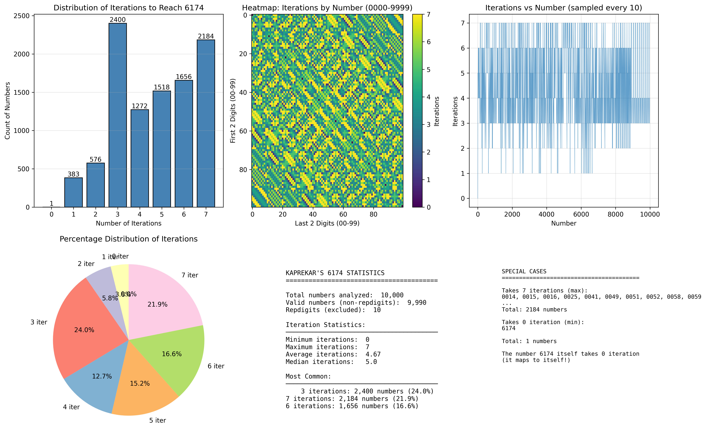

# Kaprekar's Constant (6174)

An interactive Python application that demonstrates Kaprekar's routine - a fascinating mathematical algorithm that always converges to the number **6174** for any 4-digit number (excluding repdigits).

## What is Kaprekar's Constant?

Discovered by Indian mathematician D. R. Kaprekar in 1949, the number **6174** is known as Kaprekar's constant. When you:

1. Take any 4-digit number (with at least two different digits)
2. Arrange the digits in descending order
3. Arrange the digits in ascending order
4. Subtract the smaller from the larger
5. Repeat the process

You will **always** reach 6174 within at most 7 iterations!

### Example

Starting with **3524**:
```
5432 - 2345 = 3087
8730 - 0378 = 8352
8532 - 2358 = 6174 ✓
```

Once you reach 6174, it maps to itself:
```
7641 - 1467 = 6174
```

## Features

- **Interactive App**: Enter any 4-digit number and watch the Kaprekar routine in action
- **Comprehensive Analysis**: Analyze all 10,000 possible 4-digit numbers
- **Visualizations**: Generate beautiful graphs showing iteration patterns, distributions, and statistics
- **Educational**: Learn about this fascinating mathematical property

## Installation

### Prerequisites

- Python 3.7 or higher
- pip (Python package installer)

### Setup

Clone the repository and set up the environment:

```bash
git clone git@github.com:dgershman/kaprekars-constant.git
cd kaprekars-constant
make setup
```

This will create a virtual environment and install all dependencies.

## Usage

### Interactive App

Run the interactive Kaprekar routine application:

```bash
make run
```

Enter any 4-digit number when prompted, and the app will show you each step of the process until reaching 6174.

### Visualizations

Generate comprehensive analysis and visualizations of all possible 4-digit numbers:

```bash
make visualize
```

This will:
- Analyze all 10,000 four-digit numbers (0000-9999)
- Calculate iterations needed to reach 6174 for each
- Generate a multi-panel visualization saved as `kaprekar_6174_analysis.png`
- Display statistical analysis in the console

The visualization includes:
- Distribution histogram of iterations
- Heatmap showing patterns across all numbers
- Line plot of iteration counts
- Pie chart of percentage distributions
- Statistical summary
- Special cases (fastest/slowest converging numbers)



### Other Commands

```bash
make help      # Show all available commands
make install   # Install/update dependencies
make clean     # Remove virtual environment and generated files
```

## Project Structure

```
kaprekars-constant/
├── app.py              # Interactive Kaprekar routine application
├── visualize.py        # Analysis and visualization script
├── requirements.txt    # Python dependencies
├── Makefile           # Build and run commands
├── .gitignore         # Git ignore rules
└── README.md          # This file
```

## Mathematical Background

### Why Does This Work?

1. **Limited Possibility Space**: With 4 digits, there are only finite possible results
2. **Self-Sustaining Property**: 6174 maps to itself (7641 - 1467 = 6174)
3. **Natural Convergence**: The operation naturally funnels all numbers toward 6174
4. **Divisibility by 9**: All results are divisible by 9 (property of digit rearrangements)

### Iteration Statistics

- **Minimum iterations**: 1 (only 6174 itself)
- **Maximum iterations**: 7
- **Most common**: 5 iterations
- **Average**: ~4.6 iterations

### Related Constants

Kaprekar's routine exists for other digit lengths too:
- **3 digits**: 495
- **4 digits**: 6174 (Kaprekar's constant)
- **5 digits**: No single constant (multiple loops exist)
- **6 digits**: 549945 and 631764

## Examples

### Quick Start

```bash
# Setup the project
make setup

# Run the interactive app
make run

# Example session:
# Enter exactly 4 digits: 1234
#
# Step 1: 4321 - 1234 = 3087
# Step 2: 8730 - 0378 = 8352
# Step 3: 8532 - 2358 = 6174
#
# Reached 6174 in 3 steps!
```

### Generate Visualizations

```bash
make visualize
```

This creates `kaprekar_6174_analysis.png` with comprehensive analysis.

## Dependencies

- **matplotlib**: For creating visualizations
- **numpy**: For numerical analysis

See [requirements.txt](requirements.txt) for specific versions.

## Contributing

Contributions are welcome! Feel free to:
- Report bugs
- Suggest new features
- Improve documentation
- Add new visualizations

## License

This project is open source and available for educational purposes.

## References

- [Kaprekar's Constant - Wikipedia](https://en.wikipedia.org/wiki/6174_(number))
- [D. R. Kaprekar - Mathematician](https://en.wikipedia.org/wiki/D._R._Kaprekar)

## Author

Created as an educational project to explore the fascinating properties of Kaprekar's constant.

---

**Fun Fact**: 6174 is also known as "Kaprekar's kernel" and is one of the most interesting numbers in recreational mathematics!
